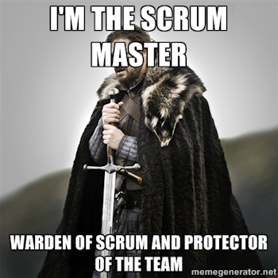
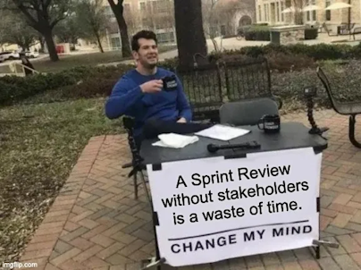
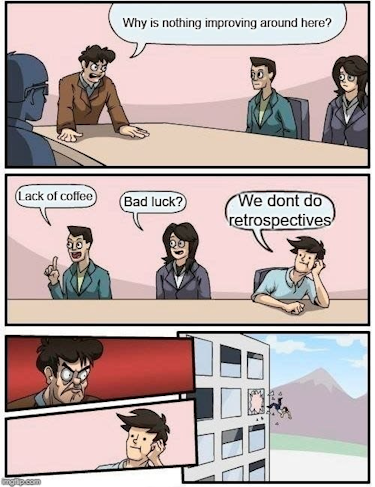

# Metodologia Ágil e Scrum

# O que é ágil?
Significado de ágil no dicionário [Priberam](https://dicionario.priberam.org/%C3%A1gil)

## Ágil vs Cascata

### O modelo Cascata se provou uma estratégia falha ou obsoleta?

- E se surgirem novos requisitos após a fase de levantamentos de requisitos, o que fazemos?
- E se na fase de verificação e validação for descoberta uma falha ou até mesmo um gap, o que fazemos?
- Depois que um projeto ou produto é entregue ele está finalizado e o time pode ser desalocado?

### Não!

O modelo cascata é utilizado, principalmente, quando os requisitos são bem compreendidos. Cascata funciona bem em ambientes muito estáveis e com grande previsibilidade.

---

### O que é mais fácil, manobrar o Titanic ou uma lancha?

Quando o ambiente é complexo e instável é necessário ter grande capacidade de adaptação.

### **Ser Ágil é responder rápido à mudanças.**

---

---
# Manifesto para Desenvolvimento Ágil de Software

Estamos descobrindo maneiras melhores de desenvolver
software, fazendo-o nós mesmos e ajudando outros a
fazerem o mesmo. Através deste trabalho, passamos a valorizar:

- **Indivíduos e interações** mais que processos e ferramentas
- **Software em funcionamento** mais que documentação abrangente
- **Colaboração com o cliente** mais que negociação de contratos
- **Responder a mudanças mais** que seguir um plano

**Ou seja, mesmo havendo valor nos itens à direita, valorizamos mais os itens à esquerda.**

Leia mais: [Manifesto Ágil](https://agilemanifesto.org/iso/ptbr/manifesto.html)
## Doze Princípios do Software Ágil
Nós seguimos estes princípios:

- Nossa maior prioridade é satisfazer o cliente
através da entrega contínua e adiantada
de software com valor agregado.

- Mudanças nos requisitos são bem-vindas,
mesmo tardiamente no desenvolvimento.
Processos ágeis tiram vantagem das
mudanças visando vantagem competitiva para o cliente.

- Entregar frequentemente software funcionando,
de poucas semanas a poucos meses,
com preferência à menor escala de tempo.

- Pessoas de negócio e desenvolvedores devem trabalhar
diariamente em conjunto por todo o projeto.

- Construa projetos em torno de indivíduos motivados.
Dê a eles o ambiente e o suporte necessário
e confie neles para fazer o trabalho.

- O método mais eficiente e eficaz de transmitir
informações para e entre uma equipe de desenvolvimento
é através de conversa face a face.

- Software funcionando é a medida primária de progresso.

- Os processos ágeis promovem desenvolvimento
sustentável. Os patrocinadores, desenvolvedores e
usuários devem ser capazes de manter um ritmo
constante indefinidamente.

- Contínua atenção à excelência técnica e bom design
aumenta a agilidade.

- Simplicidade--a arte de maximizar a quantidade de
trabalho não realizado--é essencial.

- As melhores arquiteturas, requisitos e designs
emergem de equipes auto-organizáveis.

- Em intervalos regulares, a equipe reflete sobre como
se tornar mais eficaz e então refina e ajusta seu
comportamento de acordo.

Leia mais: [Princípios do Software Ágil](https://agilemanifesto.org/iso/ptbr/principles.html)

# O que é Scrum?

Scrum é um **framework** leve que ajuda pessoas, times e organizações a gerar valor por meio de soluções **adaptativas** para **problemas complexos** de forma **incremental** e **colaborativa**. Pense nisso como uma maneira de fazer o trabalho em equipe em pequenas partes de cada vez, com **experimentos** e **ciclos de feedback** ao longo do caminho.

Leia mais: [Scrum.org](https://www.scrum.org/learning-series/what-is-scrum)

### Teoria do Scrum

Scrum é baseado no empirismo e lean thinking. O empirismo afirma que o conhecimento vem da experiência e da tomada de decisões com base no que é observado. O lean thinking reduz o desperdício e se concentra no essencial.

# Scrum na prática

Em suma, Scrum requer um **Scrum Master** para promover um ambiente onde:

1. Um Product Owner ordena o trabalho para um problema complexo em um Product Backlog.
2. O Scrum Team transforma uma seleção do trabalho em um incremento de valor durante uma Sprint.
3. O Scrum Team e seus stakeholders inspecionam os resultados e se ajustam para a próxima Sprint.
4. Repita

## Scrum Team

A unidade fundamental do Scrum é um **pequeno time de pessoas**, um **Scrum Team**. O Scrum Team consiste em um **Scrum Master, um Product owner e Developers**. Dentro de um Scrum Team, **não há sub-times ou hierarquias**. É uma unidade coesa de profissionais focados em um **objetivo de cada vez**, a Meta do Produto.

Os Scrum Teams são **multifuncionais**, o que significa que os membros possuem **todas as habilidades necessárias para criar valor a cada Sprint**. Eles também são autogerenciáveis, o que significa que **decidem internamente quem faz o quê, quando e como**.

### Developers

Developers são as pessoas do Scrum Team que estão comprometidas em criar qualquer aspecto de um Incremento utilizável a cada Sprint.

Os Developers são **sempre responsáveis por**:
- Criar um plano para a Sprint, o Sprint Backlog;
- Introduzir gradualmente qualidade aderindo a uma Definição de Pronto;
- Adaptar seu plano a cada dia em direção à meta da Sprint; e,
- Responsabilizar-se mutuamente como profissionais.

### Product Owner

O Product Owner é responsável por **maximizar o valor do produto resultante do trabalho do Scrum Team**.

O Product Owner também é responsável pelo gerenciamento eficaz do Product Backlog , que inclui:
- Desenvolver e comunicar explicitamente a meta do produto;
- Criar e comunicar claramente os itens do Product Backlog;
- Ordenar os itens do Product Backlog; e,
- Garantir que o Product Backlog seja transparente, visível e compreensível.

O Product Owner pode fazer o trabalho acima ou pode delegar a responsabilidade a outros. Independentemente disso, o Product Owner ainda é o responsável.

**Importante!**

*O Product Owner, não necessáriamente, é o maior especialista nas questões técnicas e de implementação do produto. Isso é função dos developers.*

### Scrum Master

O Scrum Master é responsável por estabelecer o Scrum conforme definido no Guia do Scrum. Eles fazem isso ajudando todos a entender a teoria e a prática do Scrum, tanto no Scrum Team quanto na organização.

Scrum Masters são verdadeiros líderes que servem ao Scrum Team e à organização como um todo, incluindo.

- Treinar os membros do time em autogerenciamento e cross-funcionalidade;
- **Ajudar o Scrum Team a se concentrar na criação de incrementos de alto valor** que atendem à Definição de Pronto;
- **Provocando a remoção de impedimentos ao progresso do Scrum Team**; e,
- **Garantir que todos os eventos Scrum ocorram e sejam positivos, produtivos e mantidos dentro do Timebox**.

## Eventos Scrum

A Sprint é um contêiner para todos os outros eventos. Cada evento no Scrum é uma oportunidade formal para inspecionar e adaptar os artefatos do Scrum. Esses eventos são projetados especificamente para permitir a transparência necessária.

### A Sprint

Sprints são o coração do Scrum, onde ideias são transformadas em valor.

São eventos de duração fixa de um mês ou menos para criar consistência. **Uma nova Sprint começa imediatamente após a conclusão da Sprint anterior.**

**Todo o trabalho** necessário para atingir a meta do Produto, incluindo Sprint Planning, Daily Scrums, Sprint Review e Sprint Retrospective, **acontece dentro de Sprints**.

Durante a Sprint:
- Nenhuma mudança é feita que coloque em risco a meta da Sprint;
- A qualidade não diminui;
- O Product Backlog é refinado conforme necessário; e,
- O escopo pode ser esclarecido e renegociado com o Product Owner conforme mais é aprendido.

**Importante!**

Quando o horizonte de uma Sprint é muito longo, a meta da Sprint pode se tornar inválida, a complexidade pode aumentar e o risco pode aumentar. Sprints mais curtas podem ser empregados para gerar mais ciclos de aprendizagem e limitar os riscos de custo e esforço a um período de tempo menor.

### Sprint Planning

A Sprint Planning **inicia a Sprint ao definir o trabalho a ser realizado na Sprint**. Este plano resultante é criado pelo **trabalho colaborativo de todo o Scrum Team**.

O Product Owner garante que os participantes estejam preparados para discutir os itens mais importantes do Product Backlog e como eles são mapeados para a Meta do Produto.

A Sprint Planning aborda os seguintes tópicos:

- Por que esta Sprint é valiosa?
- O que pode ser feito nesta Sprint?
- Como o trabalho escolhido será realizado?

**Importante!**

Toda sprint, desde a primeira, precisa entregar um incremento que atenda a definição de pronto. Conceitos como Sprints Zero, Sprint de Setup ou Sprint para levantamento de requisitos não estão incluídas no Framework Scrum.

### Daily Scrum

O propósito da Daily Scrum é inspecionar o progresso em direção a Meta da Sprint e adaptar o Sprint Backlog conforme necessário, ajustando o próximo trabalho planejado.

A Daily Scrum é um evento de **15 minutos** para os **Developers do Scrum Team**. Para reduzir a complexidade, é realizado **no mesmo horário e local**, todos os dias úteis da Sprint.

**Se o Product Owner ou o Scrum Master estão trabalhando ativamente nos itens do Sprint Backlog, eles participam como Developers**.

As Daily Scrums melhoram as comunicações, identificam os impedimentos, promovem a rápida tomada de decisões e consequentemente, reduzem a necessidade de outras reuniões.

### Sprint Review

O propósito da Sprint Review é **inspecionar o resultado da Sprint e determinar as adaptações futuras**. O Scrum Team apresenta os resultados de seu trabalho para os **principais stakeholders** e o progresso em direção **a Meta do Produto é discutido**.

### Sprint Retrospective

O propósito da Sprint Retrospective é planejar maneiras de aumentar a qualidade e a eficácia.

O Scrum Team inspeciona como foi a última Sprint em relação a indivíduos, interações, processos, ferramentas e sua Definição de Pronto.

**A Sprint Retrospective conclui a Sprint.**

## Artefatos Scrum

Os artefatos do Scrum representam **trabalho ou valor**. Eles são projetados para maximizar a transparência das principais informações.

- Para o **Product Backlog**, é a **Meta do produto**.
- Para o **Sprint Backlog**, é a **Meta da Sprint**.
- Para o **incremento**, é a **Definição de Pronto**.

Esses compromissos existem para reforçar o empirismo e os valores Scrum para o Scrum Team, e seus stakeholders.

### Product Backlog

O Product Backlog é uma lista **ordenada e emergente** do que é necessário para **melhorar o produto**. É a **única fonte de trabalho realizado pelo Scrum Team**.

Os Developers que farão o trabalho são responsáveis pelo dimensionamento. O Product Owner pode influenciar os Developers, ajudando-os a entender e selecionar trade-offs (trocas de itens).

**Importante!**

*O Product Backlog refinement é o ato de quebrar e incluir definição adicional aos itens do Product Backlog para ter itens menores e mais precisos. Esta é uma atividade contínua para adicionar detalhes, como descrição, ordem e tamanho.*

### Compromisso: Meta do Produto

A Meta do Produto descreve um **estado futuro do produto** que pode servir como um alvo para o Scrum Team planejar. **A Meta do produto está no Product Backlog**. O restante do Product Backlog emerge para definir “o que” **cumprirá a Meta do Produto**.

### Sprint Backlog

O Sprint Backlog é composto pela **Meta da Sprint** (por que), o conjunto de **itens do Product Backlog** selecionados para a Sprint (o que), bem como um **plano de ação** para entregar o Incremento (como).

É uma imagem altamente visível, em tempo real do trabalho que os Developers planejam realizar durante a Sprint para atingir a Meta da Sprint. O Sprint Backlog é **atualizado ao longo da Sprint conforme mais é aprendido**. Deve ter detalhes suficientes para que eles possam **inspecionar seu progresso na Daily Scrum**.

**Importante!**

*O Sprint Backlog é um plano feito por e para os Developers.*

### Meta da Sprint

A Meta da Sprint é o **único objetivo da Sprint**. A Meta da Sprint cria **coerência e foco**, encorajando o Scrum Team a **trabalhar junto ao invés de iniciativas separadas**.

### Incremento

Um incremento é um trampolim concreto em **direção a Meta do produto**. Cada incremento é **adicionado a todos os incrementos anteriores** e completamente verificado, garantindo que todos os incrementos **funcionem juntos**. A fim de fornecer valor, o incremento deve ser **utilizável**.

Vários incrementos podem ser criados em uma Sprint.

O trabalho não pode ser considerado parte de um incremento a menos que atenda a Definição de Pronto.

**Importante**

*A Sprint Review nunca deve ser considerada um marco para liberar valor.*

### Compromisso: Definição de Pronto

A Definição de Pronto é uma descrição formal do estado do Incremento quando ela atende às medidas de qualidade exigidas para o produto.

No momento em que um **item do Product Backlog atende a Definição de Pronto, um incremento nasce**.

A Definição de Pronto cria transparência ao fornecer a todos um entendimento compartilhado de qual trabalho foi concluído como parte do Incremento.

Se um item do Product Backlog não atender à Definição de Pronto, ele **retorna ao Product Backlog para consideração futura**.

**Importante!**

*Se não for um padrão organizacional, o Scrum Team deve criar uma Definição de Pronto apropriada para o produto.*

# Considerações finais

### Teste seu conhecimento

Faça o teste e saiba qual é o seu nível de compreensão de Scrum.

1. [Scrum Open Assessment](https://www.scrum.org/open-assessments/scrum-open)
2. [Professional Scrum Master Practice Assessment](https://www.thescrummaster.co.uk/assessments/professional-scrum-master-i-psm-i-practice-assessment/)

### Frameworks Ágeis

Scrum é um Framewrok Ágil muito popular, porém não é o único.

Leia mais: [Principais Frameworks Ágeis](https://blog.adapt.works/quais-sao-os-principais-frameworks-ageis/)

# Nota Final

Scrum é gratuito.

O framework Scrum, conforme descrito no Guia Scrum, é **imutável**. Embora a implementação de apenas partes do Scrum seja possível, o resultado **não é Scrum**.

Scrum existe apenas em sua totalidade e funciona bem como um contêiner para outras técnicas, metodologias e práticas.

---
# Autor

**Luis Gustavo Pereira Rodrigues**

*Software Development Specialst - Encora*

- [GitHub](https://github.com/rodrigueslg/)
- [LinkedIn](https://www.linkedin.com/in/rodrigueslg/)
- [Instagram](https://www.instagram.com/rodrigueslg_/)

---

---

# Fontes
- [Dicionário Priberam](https://dicionario.priberam.org/%C3%A1gil)
- [Modelo Cascata: Saiba como usar em Projetos](https://www.laboneconsultoria.com.br/modelo-cascata-o-que-e/)
- [Manifesto Ágil](https://agilemanifesto.org/iso/ptbr/manifesto.html)
- [Scrum.org](https://www.scrum.org/learning-series/what-is-scrum)
- [Guia Scrum](https://scrumguides.org/index.html)
- [The Scrum Master](https://www.thescrummaster.co.uk)
